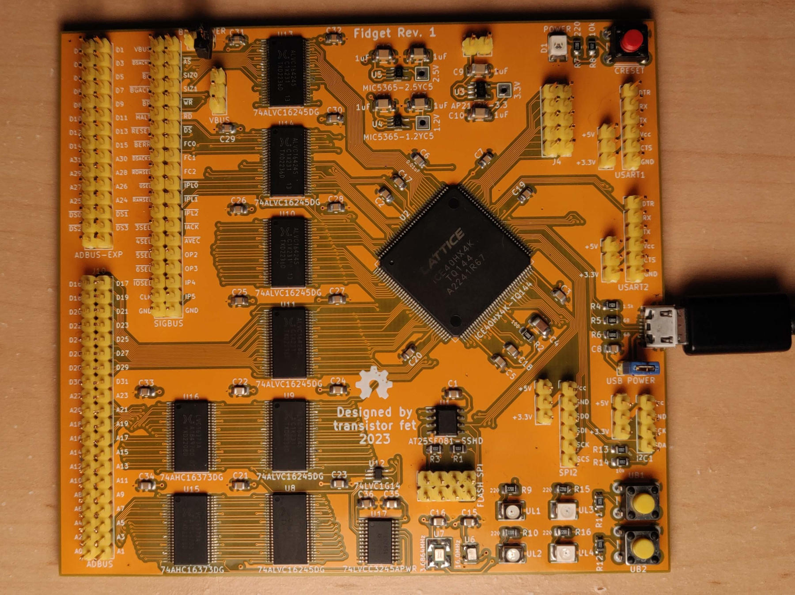
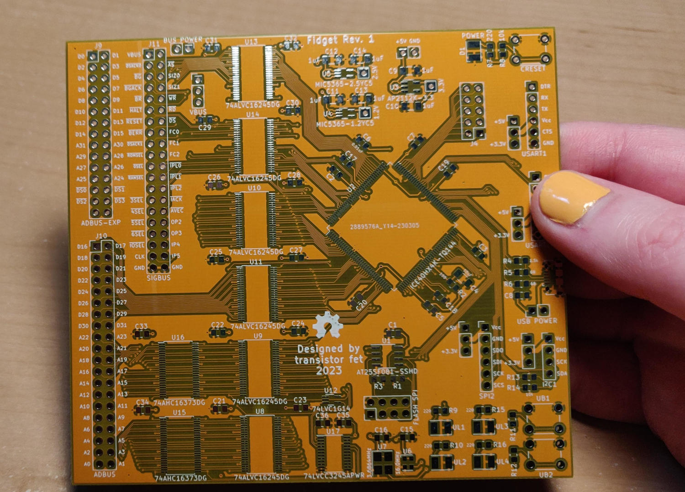
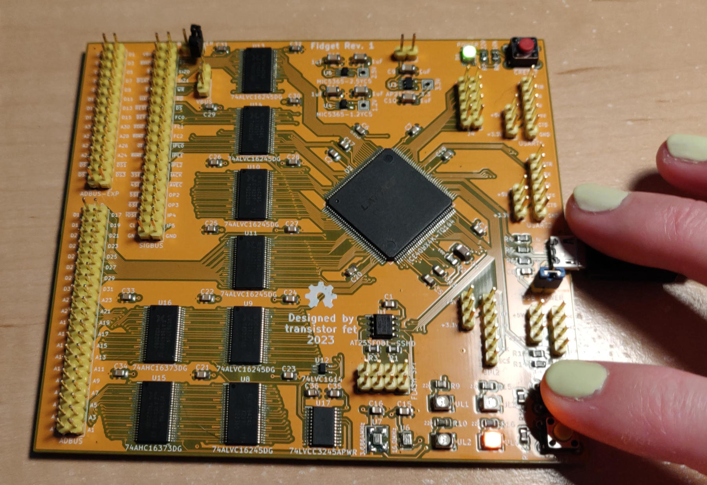

Fidget - The FPGA Widget
========================

###### *Started January 5, 2023*

This project is an experiment in making a board using a Lattice iCE40 FPGA in a surface mount
package (LQFP-144).  It has bus connectors to allow it to be hooked up to one of the
[Computie](https://jabberwocky.ca/projects/computie/) single board computers, to be used as either a
debug monitor to replace the arduino supervisor, or as a generic expansion device for the computers.
I'd also like to be able to use it more generically as well, for example as a logic analyzer, which
is why it's called a widget.

It needs to have bus transceivers to level convert between the 5V signals of the Computie expansion
bus, and the 3.3V I/O pins of the FPGA.  To save on I/Os, the address and data bus lines are
multiplexed using the level-converting transceivers.  I also added the latches necessary to make a
request on the bus.  Without the latches, the device will only be able to receive bus requests but
not make them.

The basic design of the USB and power supply circuitry was mostly copied from the [TinyFPGA
BX](https://www.crowdsupply.com/tinyfpga/tinyfpga-ax-bx) development board.  I bought one back in
early 2020, and have an environment set up for developing for it.  I was able to reuse the
bootloader and upload utility from that to accelerate the bring-up of this board.  I highly
recommend checking it out, especially since it sounds like they will have more boards for sale soon
in 2023.  It's an excellent affordable open source board which is great for experimenting with
verilog and FPGAs.

The schematics can be seen online
[here](https://github.com/transistorfet/fidget/blob/main/hardware/Fidget/Fidget.pdf) or in KiCAD.



This repository uses submodules, and can be cloned using:
```
git clone --recurse-submodules git@github.com:transistorfet/fidget.git
```

Building the Board
------------------

It was surprisingly easy to build, although my attempts at documenting the soldering of the
transceivers resulted in more mistakes than it was worth.  I had solder bridges on every chip that
required some solder wick, and I had a few chips that were crooked enough that I decided to just use
the hot air rework station to remove them and resolder them.  The FPGA was actually much easier to
solder by comparison.  The other parts I had trouble with were the oscillators, which come in a
module on a tiny circuit board with castellated pins on the edges.  The 3.6864 Mhz one was easy
because the footprint turned out to be way bigger than the chip, but the 16 MHz one was the right
size for the part but with not enough clearance for hand soldering.  In future revisions I'll have
to make the footprint bigger.

I started with the 3.3V regulator and tested it with a bench power supply at 5V to verify that I was
getting 3.3V output, which is used by the transceivers.  I then soldered the transceivers and
latches at once, along with their caps, and tested at the end of that.  I put the SPI flash and
oscillators on and tested those with the bench supply to make sure I was getting signal.  The 16 Mhz
oscillator needed a lot of reworking and desoldering.

With the SPI flash chip in, I programmed it (see below).  I also put the other voltage regulators in
and tested them before soldering the FPGA.  With the all the power good, I put the other LEDs,
buttons on, as well as the FPGA itself with its associated caps.  After checking for shorts, I
tested it to see what would happen.  Surprisingly it worked, with the bootloader slowly blinking one
of the LEDs to indicate it was running, so the configuration I had written to the flash chip was
good.  I then put on the remaining headers which were the last components to solder.

At the end, and between the two days I was assembling, I cleaned the flux off with a toothbrush and
some soap and/or rubbing alcohol.  I then blow dried the board to make sure the water under the
chips was dry before it had a chance to corrode any pins.  It's best to not get the board too hot
when doing this.

I like to use water soluble liquid flux.  The No Clean stuff is much harder to clean up after, but
it doesn't have to be cleaned off, where as the water soluble stuff can corrode the pins if it's not
cleaned off, but works better and is easy to clean.

For soldering, I use a soldering tip that's cone-shaped but cut off at an angle to form a large flat
surface.  It heats the pad on the board better than a round tip, which gives a good solder
connection for SMT components, even though it's wider than individual pins.  The solder mask and
flux make the solder flow well and not bridge.  I have a Quick 861DW hot air rework station for when
I make mistakes, but I only needed to use it twice, once to remove the 3 crooked
transceivers/latches, which probably would have been ok if I had left them, and once to remove the
16 MHz oscillator.

Initializing the Board
----------------------

To load the initial bootloader, I used [spi-flash-programmer](https://github.com/nfd/spi-flash-programmer)
and an [AdaFruit QT Py](https://www.adafruit.com/product/4600) I had laying around, which just
happened to be the most convenient 3.3V Arduino-compatible board I had available, but any 3.3V
Arduino will do.  I uploaded the flash programmer to it, but I needed to adjust the SPI speed
because the default was too high for the long dupont wires I used to connect it to Fidget.

I programmed the SPI chip in circuit before I soldered the FPGA in place, just in case they
interfered, which was a good idea because they did interfere.  With the FPGA in circuit, the RESET
button needs to be held for the duration of SPI programming (preferably for the whole time the
Arduino is connected), or it won't work.

I connected the SCK, SDI, and SDO signals on the Arduino to the SPI Flash header on Fidget, along
with a general purpose I/O (I used A0/D0) connected to the CS pin on the header.  I also connected
power from the QT Py to power the board while programming, which does also power the FPGA and
transceivers, but since the QT Py has the exact same 3.3V regulator I used, as it turns out, which
is capable of 600mA, it has no problem powering the whole board up.

I compiled the [TinyFPGA Bootloader](https://github.com/tinyfpga/TinyFPGA-Bootloader), using a board
configuration based on the BX, but with the device to compile to changed (hx4k-tq144) and pin
assignments changed.  Compiling it with `make` produces a fw.bin file, as well as bootloader_0.bin,
and bootloader_1.bin.

As it turned out, I needed to write fw.bin to the start of the device, even though at the end of
compiling it says to write bootloader_0.bin to 0xa0, and bootloader_1.bin to 0x28000.  Before I put
the chip on, I wrote the two images separately with some zero padding at the start, and for some
reason it still worked when I put the chip on.  I later reprogrammed it once I was able to program
in-circuit after some unrelated problems with a wire not making good connection.

The first 0xa0 bytes of data is actually the boot vector table used by the FPGA itself to locate the
configurations in the remaining part of memory.  It has 5 entries, one for the cold boot
configuration to load at startup, and the remaining 4 for the selectable warm boot configurations.
The TinyFPGA bootloader only uses 2 configurations, the bootloader itself, and the user program.,
and puts the bootloader as the target of all the other entries.  For more info on the boot vectors,
check out [https://umarcor.github.io/warmboot/](https://umarcor.github.io/warmboot/).

The bootloader didn't work at first.  It would raise uncaught exceptions everywhere, but it turned
out to be that it was trying to load meta data and there wasn't any programmed into the SPI Flash.
I didn't know this was needed, and for some reason using the bootloader to program the security page
would say that it worked but would always read back 0xFFs.  I haven't tried putting it in user
memory, which the bootloader also checks for metadata.  I just hacked it to use the default TinyFPGA
BX meta data and it programs just fine.  I'll fix it properly, eventually.

I had some other issues with the blinking led test, where it just wouldn't work, but it turned out
to be that I had the HX1K device still configured, from before I decide to switch to the HX4K.  The
1k device wasn't big enough to house the configuration for the bootloader, which left me kind of
hooped unless I switched.  The 4ks aren't as easily available but I managed to buy a few from
another distributor I don't normally buy from.

Now I can upload configuration through USB using tinyprog and the bootloader!

```sh
python3 spi_flash_programmer_client.py -d /dev/ttyACM2 --io 0 write -f fw.bin -l 0x28000 --pad 0xff
```

Loading through the Bootloader
------------------------------

I currently have the meta data hacked in, but it can be written to the security pages or to an area
of the SPI Flash.  It's in `rtl/TinyFPGA-Bootloader/boards/Fidget/metadata.json`.  With that, it
should recognize the boot loader and upload

From the `rtl/TinyFPGA-Bootloader/programmer`:
```sh
python3 -m tinyprog -p ../../blinking_led/fidget.bin
```





